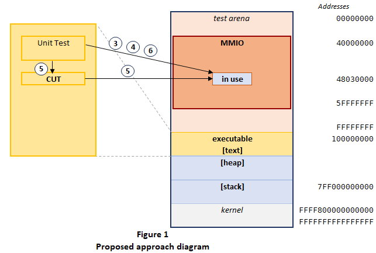

## STUBMMIO

MMIO stub library for off-target embedded unit tests

### Introduction 

Off-target testing - building and running tests  _"on a development host or build server rather than on the target hardware"_ . [[3]](#ref3)

`stubmmio` is a C++ library for off-target embedded unit tests by stubbing MCU’s MMIO regions on a Linux machine. 
Memory-mapped I/O (MMIO) is a method of performing I/O through registers, mapped to MCU’s address space [[1]](#ref1).

`stubmmio` allows the users to substitute MMIO registers of interest with the host memory, setup the initial state of 
the stubbed MMIO registers, and verify their state against expected after running the code under test.

### Principle of Operation



An off-target unit test:
1. _Assumes_  the code under test (CUT) has been compiled for the host and is callable from a C++ code
2. Reserves MMIO address space (test arena) in the host process memory
3. Maps MMIO-in-use with `mmap`
4. Setups MMIO-in-use at the state, predefined by the running test case
5. Runs CUT
6. Validates MMIO state

`stubmmio` provides classes to support this approach:
* `stubmmio::stub` to map the MMIO-in-use and setting up initial state
* `stubmmio::verify` to validate MMIO state
* `stubmmio::stimulus` to simulate simple asynchronous behaviour of the peripheral

### CUT Constraints

Off-target embedded UT with `stubmmio` imposes the following constraints: 
1. CUT compiles for the host
2. CUT is callable from C++ (e.g. written in C or C++)
3. CUT does not have an infinite loop
4. CUT does not relay or precise timing
5. CUT does not expect complicated behaviour of the hardware

### Primary Classes

#### `stubmmio::stub`

`stubmmio::stub` is a collection of memory elements. A memory element is a continuous memory range staring at a given address. 
The stub memory elements usually have initial data. When a stub is applied, it allocates memory pages to for all its elements 
and writes initial element data. On destruction, stub deallocates all pages. Multiple `stubmmio::stub` instances are allowed, 
provided they refer to different host memory pages. A `stubmmio::stub` instance owns the allocated pages, so that other 
instances cannot use pages, owned by this instance.

#### `stubmmio::verify`

`stubmmio::verify` is a  collection of memory elements. Its elements are used to compare the elements’ data with the memory state.
`stubmmio::verify` ensures that every of its element refers to a page, previously allocated by a `stubmmio::stub` instance.

#### `stubmmio::stimulus`

`stubmmio::stimulus` is a pair MMIO addresses, associated with condition and action. 
After `stubmmio::stimulus` instantiation, the condition is asynchronously monitored. When its condition satisfied, 
the action is executed. The main purpose of `stubmmio::stimulus` is to simulate simple hardware behaviour, essential for the 
CUT to complete its operations.

#### `stubmmio::stub::initializer_list` and `stubmmio::verify::initializer_list`

These `initializer_list` classes facilitate composition of `stub` and `vefify` instances from pieces, shared among multiple tests of a test suite.

### Unit Test Framework

`stubmmio` does not imply any particular UT framework. For its own tests it uses `boost::ut`. The users are free to use a C++ UT framework of their choice.

### Off-Target Build

Aspects, associated with compilation of CUT for the host are not in scope of this project. 

### Address Space

`stubmmio` is suitable for testing code for 8-, 16-, and 32-bit target MCU's, which have address space in ranges up to `00000000-FFFFFFFF`. 
Off-target UT are expected to be built for a `x86_64` Linux machine, which has plenty of unused address space. 
However, depending on the compiler in use, this layout may overlap with MMIO layout. 

#### Reserving the Test Arena

The easiest way to reserve a suitable address space layout is to enable PIE and ASLR with compiler options `‑fPIE ‑pie`. 
This effectively moves memory layout of the executable in the upper address space, making the entire `00000000-FFFFFFFF` 
range available for `mmap`.

However, in cases when MCU MMIO addresses are provided via a linker script (such as MSP430 projects), ASLR also randomizes those MMIO addresses.
So, the UT executable should be linked with `-Wl,-no-pie -Wl,-Ttext-segment=0x60000000`, which reserves `00000000-5FFFFFFF` range.

In all cases static linking is recommended, any third-party shared libraries better be avoided. 

#### Using Address Range `0000-FFFF`

The first 64K are restricted for use by a kernel tunable and can be allowed with vm.mmap_min_addr set to zero [[2]](#ref2).

#### Access to Unmapped Memory

When CUT attempts to access MMIO, not backed with the host memory, the UT process expectingly terminates with `SIGSEGV`, 
leaving remaining tests not run. `stubmmio` provides an easy way for converting `SIGSEGV` into exception with `stubmmio::util::handle_sigsegv()`. 
The exception is then captured with the UT framework, marking the corresponding tests as failed, and the test execution can be continued.

### Examples

#### Simple example
```cpp
using namespace stubmmio;
// Declare the initial memory setup
const stub setup { // TB0CTL is a periferal registers
    {&TB0CTL, 0U}
};
// Declare the expected memory state
const verify expected {
    {&TB0CTL, TBSSEL__SMCLK | MC__CONTINUOUS},
};
setup();            // Activate the stub
Timer_init();       // Run CUT
expect(expected()); // Verify expected memory state
```

#### Example with a stimulus

```cpp
using namespace stubmmio;

// USIC0_CH1, VADC and VADC_G1 are pereifal regsiters
stub state_on_reset { 
    {USIC0_CH1, USIC_CH_StateOnReset()}, // Initialize USIC0_CH1 with data returned by  USIC_CH_StateOnReset()
    {VADC, VADC_StateOnReset()},         // Initialize VADC with data returned by VADC_StateOnReset()
    {VADC_G1, VADC_G_NotReady()},        // Initialize VADC_G1 with data returned by VADC_StateOnReset()
}};
const verify state_after_test = {
    { &SCU_GENERAL->PASSWD, 0x000000C3U },
    { &SCU_CLK->CGATCLR0, SCU_CLK_CGATCLR0_VADC_Msk },
    { &VADC->CLC, 0U },
    { &VADC->GLOBCFG, uint32_t(VADC_GLOBCFG_SUCAL_Msk | VADC_StateOnReset().GLOBCFG) },
    { &VADC_G1->RCR[7], VADC_G_RCR_WFR_Msk },
    { &VADC->BRSSEL[1], VADC_BRSSEL_CHSELG7_Msk },
    { &VADC->BRSMR, ((0x01UL << VADC_BRSMR_ENGT_Pos) | VADC_BRSMR_SCAN_Msk | VADC_BRSMR_LDEV_Msk) },
    { &VADC_G1->ARBCFG, VADC_G_ARBCFG_ANONC_Msk },
    { &VADC_G1->ARBPR, VADC_G_ARBPR_ASEN2_Msk }
};
state_on_reset(); // Activate the stub
stimulus adc_ready { // Simulates assertion of ADC ready flag upon CUT clearing VADC_CLC_DISR flag
    &VADC->CLC, [](const volatile uint32_t& clc) { return (clc & VADC_CLC_DISR_Msk) == 0; },
    &VADC->CLC, [](volatile uint32_t& clc) { clc &= ~VADC_CLC_DISS_Msk; }
};
stimulus adcg_ready { // Simulates assertion of ADCG ready flag upon CUT setting VADC_G_ARBPR_ASEN2 flag 
    &VADC_G1->ARBPR, [](const volatile uint32_t& arbpr) { return (arbpr & VADC_G_ARBPR_ASEN2_Msk) != 0; },
    &VADC_G1->ARBCFG, [](volatile uint32_t& arbcfg) { arbcfg &= ~VADC_G_ARBCFG_CAL_Msk; }
};
ADC_Init();                  // Run CUT
expect(state_after_test());  // Verify expected memory state
```

### References
1. <a name="ref1"></a>Memory-mapped I/O and port-mapped I/O<br>
   [https://en.wikipedia.org/wiki/Memory-mapped_I/O_and_port-mapped_I/O](https://en.wikipedia.org/wiki/Memory-mapped_I/O_and_port-mapped_I/O)
2. <a name="ref2"></a>mmap_min_addr, Debian Wiki<br>
   [https://wiki.debian.org/mmap_min_addr](https://wiki.debian.org/mmap_min_addr)
3. <a name="ref2"></a>Unit Testing For Embedded Software Development<br>
   https://dojofive.com/blog/unit-testing-for-embedded-software-development/
